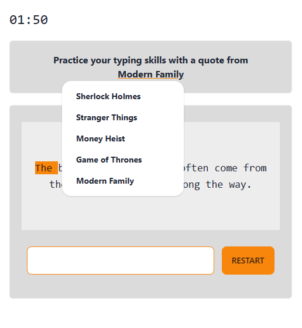
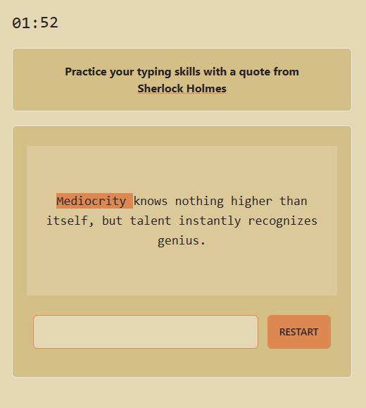
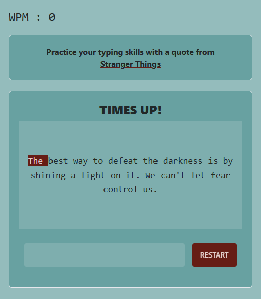

# Typing-Game

This project is a web-based application designed to enhance your typing skills by typing your favorite TV show quotes. It is built using Vanilla JavaScript, HTML, and CSS. The game provides a fun and interactive way to practice typing, measure your typing speed, and enjoy quotes from popular TV shows.

Live Demo: https://jnale-hub.github.io/Typing-Game/

## Features
- Choose from a variety of TV show themes, including Sherlock, Stranger Things, Modern Family, Game of Thrones, and Money Heist.
- Test and improve your typing speed by typing out quotes from the selected theme.
- Measure your typing speed in words per minute (WPM).
- Enjoy a user-friendly and responsive web interface for an optimal gaming experience.

## Screenshots

| Column 1 | Column 2 | Column 3 |
| --- | --- | --- |
|  |  |  |


## Run Locally

1. Clone the repository to your local machine:

   ```
   git clone https://github.com/your-username/typing-game.git
   ```

2. Open the project folder in your preferred code editor.

3. Open the `index.html` file in your web browser to start playing the game.

## Project Structure
The project follows a simple directory structure:

- `index.html`: The main HTML file that displays the game interface.
- `styles.css`: The CSS file for styling the game.
- `main.js`: The JavaScript file containing the game logic and functionality.
- `quotes.js`: Contains quotes from different TV shows, categorized by theme.

## Dependencies
The Typing-Game project has no external dependencies, as it is built using Vanilla JavaScript, HTML, and CSS. You can run the game directly in any modern web browser.

## License
This project is open-source and available under the [MIT License](LICENSE).
